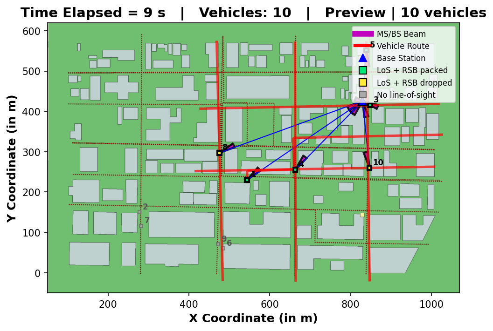
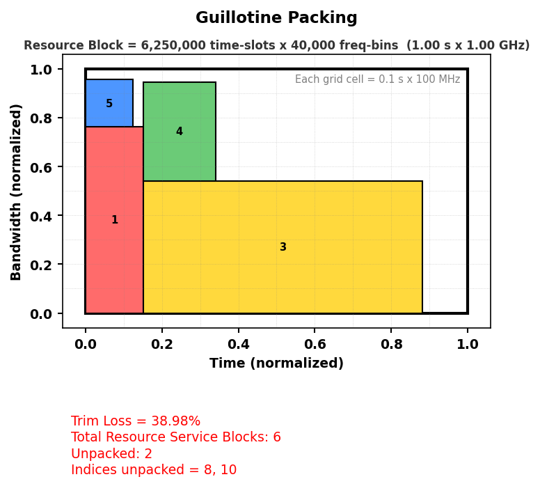

# mmwave-v2i-sim

[](https://github.com/linux-ram/mmwave-v2i-sim/actions/workflows/ci.yml)

**mmWave V2I link-layer simulator in Python**

<p align="center">
  
</p>

<p align="center">
  
</p>

## Why use this repo

| Feature | What you get |
|---------|----------------|
| **Desktop GUI** | MATLAB Figure 1 + Figure 2 layout, playback, batch runs, trim-loss trends |
| **Packing** | Guillotine, Shelf, MaxRects (2DRBP-style resource allocation) |
| **Session export** | `.zip` with JSON, CSV, and embedded NumPy workspace |
| **City presets** | Boston, San Francisco, RTP synthetic scenes ([docs/CITY_PRESETS.md](docs/CITY_PRESETS.md)) |
| **Channel** | Geometric 3D LOS, 28/39 GHz, codebook vs ideal beam modes |
| **Paper** | IEEE-style PDF — [`paper/main.pdf`](paper/main.pdf) ([build guide](docs/PAPER_BUILD.md)) |

## Quick start (under 5 minutes)

```bash
git clone https://github.com/linux-ram/mmwave-v2i-sim.git
cd mmwave-v2i-sim
python3 -m venv .venv && source .venv/bin/activate
pip install -r requirements-lock.txt
pip install -e ".[dev,gui]"
python -m mmwave_v2i_sim.cli --gui
```

Headless density sweep (Figure 3 style):

```bash
python -m mmwave_v2i_sim.cli --batch
```

## Run modes

| Command | Description |
|---------|-------------|
| `python -m mmwave_v2i_sim.cli --gui` | Interactive simulator (default) |
| `python -m mmwave_v2i_sim.cli --config configs/scenario_default.yaml` | Headless MATLAB-parity steps |
| `python -m mmwave_v2i_sim.cli --batch` | Trim-loss density sweep |
| `python scripts/demo_city_presets.py` | Boston / SFO / RTP research demos |

## Architecture

**Default (GUI):** `sim_engine` — aerial map, route LoS, 2DRBP packing.

**Research path:** `core/` + `channel/` + `mobility/` — protocol phases, city presets, dual-band channel. See [docs/MILESTONE_STATUS.md](docs/MILESTONE_STATUS.md).

## Documentation

- [User guide](docs/USER_GUIDE.md)
- [City presets](docs/CITY_PRESETS.md)
- [Paper build](docs/PAPER_BUILD.md) — PDF and figures
- [Assumptions & limitations](docs/assumptions_limitations.md)
- [Validation report](artifacts/validation/validation_report.md)

## Citation

If this simulator supports your work, please cite the **technical report title** and the **software repository**:

**Paper title:** *A Modular Python Simulator for mmWave Vehicle-to-Infrastructure Link-Layer Research*  
**Software:** [linux-ram/mmwave-v2i-sim](https://github.com/linux-ram/mmwave-v2i-sim) · **PDF:** [paper/main.pdf](paper/main.pdf)

- [BibTeX and APA examples](docs/CITATION.md) (copy-paste `@misc` / `@software` entries)
- [CITATION.cff](CITATION.cff) for GitHub “Cite this repository”
- Original MATLAB simulator: File Exchange [84948](https://www.mathworks.com/matlabcentral/fileexchange/84948)

## License

MIT — see [LICENSE](LICENSE).
