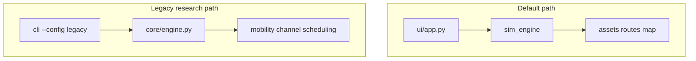

# Program milestone status (hybrid v0.1)

This table tracks the ten program milestones (`m0`–`m9`) against the current codebase.
**v0.1** ships the MATLAB-parity **`sim_engine`** path; **v0.2+** issues cover remaining acceptance tests.

| ID | Milestone | v0.1 status | Notes |
|----|-----------|-------------|-------|
| m0 | Baseline & reproducibility | **Done** | Scaffold, CI, `requirements-lock.txt` |
| m1 | Core simulation engine | **Partial** | Primary: `sim_engine` + `.npz` export; legacy: `core/` protocol engine |
| m2 | Mobility & city scene | **Partial** | Bundled/OSM Boston routes; SFO/RTP presets in legacy `mobility/` only |
| m3 | Channel, LOS, beam | **Partial** | Route LoS in `sim_engine`; geometric channel in legacy `channel/` |
| m4 | Scheduler / packing | **Done** (sim_engine) | Guillotine, Shelf, MaxRects; legacy schedulers in `scheduling/` |
| m5 | Desktop GUI | **Done** (v0.1 scope) | 2D Figure 1/2 parity, playback, trim plot; 3D/KPI panel → v0.2 |
| m6 | Scale & stability | **Partial** | GUI up to 50 vehicles; 200-veh headless via legacy config |
| m7 | Validation | **Done** (v0.1) | `sim_engine` + legacy reports in `artifacts/validation/` |
| m8 | Release readiness | **Done** (v0.1) | Docs, demo, checklist; PyInstaller binary optional |
| m9 | IEEE paper artifact | **Partial** | `paper/main.tex` + figures; PDF CI build → v0.2 |

## Architecture (dual path)

## Post v0.1 tracking

See GitHub issues (labels `milestone:m5`, `milestone:m6`, `milestone:m9`) after public release.
