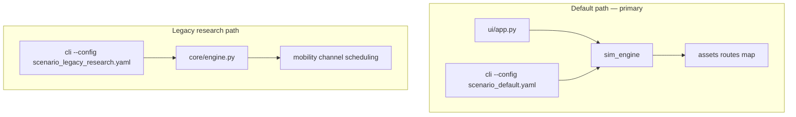

# Program milestone status (hybrid v0.1)

This table tracks the ten program milestones (`m0`–`m9`) against the current codebase.
**v0.1** ships the MATLAB-parity **`sim_engine`** path; **v0.2+** issues cover remaining acceptance tests.

| ID | Milestone | v0.1 status | Notes |
|----|-----------|-------------|-------|
| m0 | Baseline & reproducibility | **Done** | Scaffold, CI, `requirements-lock.txt` |
| m1 | Core simulation engine | **Done** (v0.1) | Primary: `sim_engine` headless CLI + ZIP session export; legacy: `core/` via `scenario_legacy_research.yaml` |
| m2 | Mobility & city scene | **Done** (v0.1 partial) | Boston bundled/OSM in `sim_engine`; SFO/RTP presets legacy-only (`mobility/city_presets.py`) |
| m3 | Channel, LOS, beam | **Done** (v0.1 partial) | Route LoS in `sim_engine`; geometric dual-band channel in legacy `channel/`; TR 38.901 deferred |
| m4 | Scheduler / packing | **Done** (sim_engine) | Guillotine, Shelf, MaxRects; legacy schedulers in `scheduling/` |
| m5 | Desktop GUI | **Done** (v0.1 scope) | 2D Figure 1/2 parity, playback, trim plot; 3D/KPI panel → issue #1 |
| m6 | Scale & stability | **Done** (v0.1 partial) | GUI max 50 vehicles; headless 200 via `scenario_scale_200.yaml`; `scripts/bench_scale.py` |
| m7 | Validation | **Done** (v0.1) | `sim_engine` + legacy reports in `artifacts/validation/` |
| m8 | Release readiness | **Done** (v0.1) | Docs, demo, checklist; PyInstaller binary optional |
| m9 | IEEE paper artifact | **Done** (v0.1 partial) | `paper/main.tex` + committed figures; PDF CI → issue #3 |

## Architecture (dual path)

### m1 acceptance (v0.1)

- Headless: `python -m mmwave_v2i_sim.cli` exports JSON (`tests/test_cli_headless.py`)
- Session ZIP: manifest, CSV, JSONL, NPZ (`tests/test_session_export.py`)
- Legacy protocol engine: phase order + determinism (`tests/test_determinism.py`)

### m2 city presets

| Preset | sim_engine (default) | Legacy `mobility/` |
|--------|----------------------|---------------------|
| Boston Seaport | Bundled `.mat` / optional OSM (`pip install -e ".[osm]"`) | `boston_seaport` synthetic grid |
| San Francisco SoMa | — | `sfo_soma` only |
| RTP campus | — | `rtp_campus` only |

Example OSM-oriented config: `configs/scenario_boston_osm.yaml` (same engine as default; OSM when `osmnx` present).

### m6 scale profiles

| Profile | Vehicles | Entry |
|---------|----------|-------|
| GUI interactive | 1, 2, 5, 10, 50 | `python -m mmwave_v2i_sim.cli --gui` |
| Headless legacy | up to 200 | `configs/scenario_scale_200.yaml`, `tests/test_scale.py` |
| Benchmark | 50 / 200 | `python scripts/bench_scale.py` |

Reference timings are machine-dependent; run `bench_scale.py` locally and record ms/step in experiment notes.

## Post v0.1 tracking

| Issue | Topic |
|-------|-------|
| #1 | m5 — 3D viewport and right-side KPI panel |
| #2 | m6 — interactive 200-vehicle GUI |
| #3 | m9 — `pdflatex` paper build in CI |

Labels: `milestone:m5`, `milestone:m6`, `milestone:m9`.
